# Org Social Relay

## Introduction

Org Social Relay is a P2P system that acts as an intermediary between all [Org Social](https://github.com/tanrax/org-social) files. It scans the network, creating an index of users, mentions, replies, groups and threads. This allows you to:

```mermaid
graph TD
    List["📋 List nodes"]
    Node1["🖥️ Node 1"]
    Node2["🖥️ Node 2"]
    Node3["🖥️ Node 3"]

    %% Social.org instances with icons
    Social1_1["📄 social.org"]
    Social1_2["📄 social.org"]
    Social2_1["📄 social.org"]
    Social2_2["📄 social.org"]
    Social3_1["📄 social.org"]
    Social3_2["📄 social.org"]

    %% Parent-child connections with labels
    List -.->|"Get"| Node1
    List -.->|"Get"| Node2
    List -.->|"Get"| Node3

    %% Node to social.org connections
    Social1_1 -->|"⚓ Connects"| Node1
    Social1_2 -->|"⚓ Connects"| Node1
    Social2_1 -->|"⚓ Connects"| Node2
    Social2_2 -->|"⚓ Connects"| Node2
    Social3_1 -->|"⚓ Connects"| Node3
    Social3_2 -->|"⚓ Connects"| Node3

    %% Bidirectional connections between nodes
    Node1 <-.->|"👥 Share Users"| Node2
    Node2 <-.->|"👥 Share Users"| Node3
    Node1 <-.->|"👥 Share Users"| Node3

    %% Modern color scheme with gradients
    classDef socialStyle fill:#667eea,stroke:#764ba2,stroke-width:3px,color:#fff,font-weight:bold
    classDef nodeStyle fill:#f093fb,stroke:#f5576c,stroke-width:3px,color:#fff,font-weight:bold
    classDef listStyle fill:#4facfe,stroke:#00f2fe,stroke-width:4px,color:#fff,font-weight:bold

    %% Apply styles
    class Social1_1,Social1_2,Social2_1,Social2_2,Social3_1,Social3_2 socialStyle
    class Node1,Node2,Node3 nodeStyle
    class List listStyle
```


[Source](/diagram.mmd)

- Receive mentions and replies.
- Have a more comprehensive notification system.
- Read or participate in threads.
- Perform searches (tags and full text).
- Participate in groups.

## API Status

| Endpoint | Status |
|----------|---------|
| `/` | ✅ |
| `/feeds/` (GET) | ✅ |
| `/feeds/` (POST) | ✅ |
| `/mentions/` | ✅ |
| `/replies/` | ❌ |
| `/search/` | ❌ |
| `/groups/` | ❌ |
| `/groups/{id}/members/` | ❌ |
| `/groups/{id}/messages/` | ❌ |
| `/polls/` | ❌ |
| `/polls/votes/` | ❌ |

## Installation

You need to have Docker and Docker Compose installed.

### 1. Create a `.env` file based on `envExample`

```bash
cp envExample .env
```

### 2. Edit variables as needed

```bash
nano .env
```

### 3. Run with Docker Compose

```bash
docker compose up -d
```

## Make your Org Social Relay public

If you want your Relay to be used by other users, and also communicate with other public Relays to work together scanning the network and improving everyone's speed, you must make a Pull Request to this file:

https://github.com/tanrax/org-social/blob/main/org-social-relay-list.txt

Add your Relay URL (e.g. `https://my-relay.example.com`) in a new line.

## Endpoints for clients

### Root

`/` - Basic information about the relay.

```sh
curl http://localhost:8080/
```

```json
{
    "_links": [
        {"rel": "self", "href": "/", "method": "GET"},
        {"rel": "list-feeds", "href": "/feeds/", "method": "GET"},
        {"rel": "add-feed", "href": "/feeds/", "method": "POST"},
        {"rel": "get-mentions", "href": "/mentions/?feed={url feed}", "method": "GET"},
        {"rel": "get-replies", "href": "/replies/?post={url post}", "method": "GET"},
        {"rel": "search", "href": "/search?/q={query}", "method": "GET"},
        {"rel": "list-groups", "href": "/groups/", "method": "GET"},
        {"rel": "get-group-messages", "href": "/groups/{group id}/messages/", "method": "GET"},
        {"rel": "register-group-member", "href": "/groups/{group id}/members/?feed={url feed}", "method": "POST"},
        {"rel": "list-polls", "href": "/polls/", "method": "GET"},
        {"rel": "get-poll-votes", "href": "/polls/votes/?post={url post}", "method": "GET"}
    ]
}
```

### List feeds

`/feeds/` - List all registered feeds.

```sh
curl http://localhost:8080/feeds/
```

```json
{
    "type": "Success",
    "errors": [],
    "data": [
        "https://example.com/social.org",
        "https://another-example.com/social.org"
    ]
}
```

### Add feed

`/feeds/` - Add a new feed to be scanned.

```sh
curl -X POST http://localhost:8080/feeds/ -d '{"feed": "https://example.com/path/to/your/file.org"}' -H "Content-Type: application/json"
```

```json
{
    "type": "Success",
    "errors": [],
    "data": {
        "feed": "https://example.com/path/to/your/file.org"
    }
}
```


### Get mentions

`/mentions/?feed={url feed}` - Get mentions for a given feed. Results are ordered from most recent to oldest.

```sh
curl http://localhost:8080/mentions/?feed=https://example.com/social.org
```

```json
{
    "type": "Success",
    "errors": [],
    "data": [
        "https://foo.org/social.org#2025-02-03T23:05:00+0100",
        "https://bar.org/social.org#2025-02-04T10:15:00+0100",
        "https://baz.org/social.org#2025-02-05T08:30:00+0100"
    ],
    "meta": {
        "feed": "https://example.com/social.org",
        "total": 3,
        "version": "123"
    }
}
```

The `version` in the `meta` field is a unique identifier for the current state of mentions for the given feed. You can use it to check if there are new mentions since your last request.

### Get replies/threads

`/replies/?post={url post}` - Get replies for a given post. This will return a tree structure with all the replies to posts in the given feed. If you want to see the entire tree, you must use the meta `parent` as a  `post`.

```sh
curl http://localhost:8080/replies/?post=https://foo.org/social.org#2025-02-03T23:05:00+0100
```

```json
{
    "type": "Success",
    "errors": [],
    "data": [
        {
            "post": "https://bar.org/social.org#2025-02-02T14:30:00+0100",
            "children": [
                {
                    "post": "https://baz.org/social.org#2025-02-03T09:45:00+0100",
                    "children": []
                },
                {
                    "post": "https://qux.org/social.org#2025-02-04T16:20:00+0100",
                    "children": [
                        {
                            "post": "https://quux.org/social.org#2025-02-05T11:10:00+0100",
                            "children": []
                        }
                    ]
                }

            ]
        },
        {
            "post": "https://corge.org/social.org#2025-02-03T18:00:00+0100",
            "children": []
        }
    ],
    "meta": {
        "parent": "https://moo.org/social.org#2025-02-03T23:05:00+0100",
        "version": "123"
    }
}
```

The `version` in the `meta` field is a unique identifier for the current state of replies for the given post. You can use it to check if there are new replies since your last request.

### Search

`/search/?q={query}` - Search posts by free text.
`/search/?tag={tag}` - Search posts by tag.

```sh
curl http://localhost:8080/search?q=emacs
```

Optional parameters:

- `page`: Page number (default: 1)
- `perPage`: Results per page (default: 10, max: 50)

```json
{
    "type": "Success",
    "errors": [],
    "data": [
        "https://foo.org/social.org#2025-02-03T23:05:00+0100",
        "https://bar.org/social.org#2025-02-04T10:15:00+0100",
        "..."
    ],
    "meta": {
        "version": "123",
        "query": "example",
        "total": 150,
        "page": 1,
        "perPage": 10,
        "hasNext": true,
        "hasPrevious": false,
        "links": {
            "next": "/search?q=example&page=2",
            "previous": null
        }
    }
}
```

The `version` in the `meta` field is a unique identifier for the current state of the search index. You can use it to check if there are new results since your last request.

### List groups

`/groups/` - List all groups from the relay.

```sh
curl http://localhost:8080/groups/
```

```json
{
    "type": "Success",
    "errors": [],
    "data": [
        {
            "id": 1,
            "name": "emacs",
            "description": "A group for Emacs enthusiasts.",
            "members": 120,
            "posts": 450
        },
        {
            "id": 2,
            "name": "org-mode",
            "description": "Discuss everything about Org mode.",
            "members": 200,
            "posts": 800
        }
    ]
}
```

### Register as group member

`/groups/{group id}/members/?feed={url feed}` - Register a feed as a member of a group.

```sh
curl -X POST "http://localhost:8080/groups/1/members/?feed=https://example.com/social.org"
```

```json
{
    "type": "Success",
    "errors": [],
    "data": {
        "group": "emacs",
        "feed": "https://example.com/social.org"
    }
}
```

### Get group messages

`/groups/{group id}/messages/` - Get messages from a group.

```sh
curl http://localhost:8080/groups/1/messages/
```

```json
{
    "type": "Success",
    "errors": [],
    "data": [
        {
            "post": "https://foo.org/social.org#2025-02-03T23:05:00+0100",
            "children": []
        },
        {
            "post": "https://bar.org/social.org#2025-02-04T10:15:00+0100",
            "children": [
                {
                    "post": "https://baz.org/social.org#2025-02-05T08:30:00+0100",
                    "children": []
                }
            ]
        }
    ],
    "meta": {
        "group": "emacs",
        "total": 2,
        "version": "123"
    }
}
```

The `version` in the `meta` field is a unique identifier for the current state of messages in the group. You can use it to check if there are new messages since your last request.

### List polls

`/polls/` - List all polls from the relay. Results are ordered from most recent to oldest.

```sh
curl http://localhost:8080/polls/
```

```json
{
    "type": "Success",
    "errors": [],
    "data": [
        "https://foo.org/social.org#2025-02-03T23:05:00+0100",
        "https://bar.org/social.org#2025-02-04T10:15:00+0100",
        "https://baz.org/social.org#2025-02-05T08:30:00+0100"
    ],
    "meta": {
        "total": 3,
        "version": "123"
    }
}
```

The `version` in the `meta` field is a unique identifier for the current state of polls. You can use it to check if there are new polls since your last request.

### Get poll votes

`/polls/votes/?post={url post}` - Get votes for a specific poll.

```sh
curl http://localhost:8080/polls/votes/?post=https://foo.org/social.org#2025-02-03T23:05:00+0100
```

```json
{
    "type": "Success",
    "errors": [],
    "data": [
        {
            "option": "Cat",
            "votes": [
                "https://alice.org/social.org#2025-02-04T10:15:00+0100",
                "https://bob.org/social.org#2025-02-04T11:30:00+0100"
            ]
        },
        {
            "option": "Dog",
            "votes": [
                "https://charlie.org/social.org#2025-02-04T12:45:00+0100"
            ]
        },
        {
            "option": "Fish",
            "votes": []
        },
        {
            "option": "Bird",
            "votes": [
                "https://diana.org/social.org#2025-02-04T14:20:00+0100"
            ]
        }
    ],
    "meta": {
        "poll": "https://foo.org/social.org#2025-02-03T23:05:00+0100",
        "total_votes": 4,
        "version": "123"
    }
}
```

The `version` in the `meta` field is a unique identifier for the current state of votes for the given poll. You can use it to check if there are new votes since your last request.

## Technical information

You can find the public Relay list in `https://cdn.jsdelivr.net/gh/tanrax/org-social/org-social-relay-list.txt`.

### Cron

#### Scan feeds

Every 10 minutes, Relay will scan all registered feeds for new posts.

#### Scan other nodes

Every hour, Relay will search for new users on other nodes.

#### Discover new feeds

Every day, Relay analyzes the feeds of all registered users to discover new feeds they follow.
