# Org Social Relay

## Introduction

Org Social Relay is a P2P system that acts as an intermediary between all [Org Social](https://github.com/tanrax/org-social) files. It scans the network, creating an index of users, mentions, replies, groups and threads. This allows you to:

```mermaid
graph TD
    List["📋 List nodes"]
    Node1["🖥️ Node 1"]
    Node2["🖥️ Node 2"]
    Node3["🖥️ Node 3"]

    %% Social.org instances with icons
    Social1_1["📄 social.org"]
    Social1_2["📄 social.org"]
    Social2_1["📄 social.org"]
    Social2_2["📄 social.org"]
    Social3_1["📄 social.org"]
    Social3_2["📄 social.org"]

    %% Parent-child connections with labels
    List -.->|"Get"| Node1
    List -.->|"Get"| Node2
    List -.->|"Get"| Node3

    %% Node to social.org connections
    Social1_1 -->|"⚓ Connects"| Node1
    Social1_2 -->|"⚓ Connects"| Node1
    Social2_1 -->|"⚓ Connects"| Node2
    Social2_2 -->|"⚓ Connects"| Node2
    Social3_1 -->|"⚓ Connects"| Node3
    Social3_2 -->|"⚓ Connects"| Node3

    %% Bidirectional connections between nodes
    Node1 <-.->|"👥 Share Users"| Node2
    Node2 <-.->|"👥 Share Users"| Node3
    Node1 <-.->|"👥 Share Users"| Node3

    %% Modern color scheme with gradients
    classDef socialStyle fill:#667eea,stroke:#764ba2,stroke-width:3px,color:#fff,font-weight:bold
    classDef nodeStyle fill:#f093fb,stroke:#f5576c,stroke-width:3px,color:#fff,font-weight:bold
    classDef listStyle fill:#4facfe,stroke:#00f2fe,stroke-width:4px,color:#fff,font-weight:bold

    %% Apply styles
    class Social1_1,Social1_2,Social2_1,Social2_2,Social3_1,Social3_2 socialStyle
    class Node1,Node2,Node3 nodeStyle
    class List listStyle
```


[Source](/diagram.mmd)

- Receive mentions and replies.
- Have a more comprehensive notification system.
- Read or participate in threads.
- Perform searches (tags and full text).
- Participate in groups.

## Concepts

- **List nodes**: Index of public nodes. Simple list with all the URLs of the Nodes (`https://cdn.jsdelivr.net/gh/tanrax/org-social/org-social-relay-list.txt`). It will be used by nodes to find other nodes and share information.
- **Node**: A server running Org Social Relay (this software). It scans the network and shares information with other nodes or clients.
- **Client**: An application that connects to a Node to get information. It can be Org Social or any other application that implements the Org Social Relay API.

## Installation

You need to have Docker and Docker Compose installed.

### 1. Create a `.env` file based on `envExample`

```bash
cp envExample .env
```

### 2. Edit variables as needed

```bash
nano .env
```

#### Important Environment Variables

- **`GROUPS`**: Comma-separated list of group names available in the relay (optional)
  - Example: `GROUPS=Emacs,Org Social,Elisp`
  - Group names can have spaces and capital letters
  - Slugs (for URLs) are generated automatically (lowercase, spaces become hyphens)
  - Leave empty if no groups are needed
  - Groups allow users to participate in topic-based discussions

### 3. Run with Docker Compose

```bash
docker compose up -d
```

## Make your Org Social Relay public

If you want your Relay to be used by other users, and also communicate with other public Relays to work together scanning the network and improving everyone's speed, you must make a Pull Request to this file:

https://github.com/tanrax/org-social/blob/main/org-social-relay-list.txt

Add your Relay URL (e.g. `https://my-relay.example.com`) in a new line.

## Endpoints for clients

### Important Note: URL Encoding

When passing URLs as query parameters (like `feed` or `post`), they **must be URL-encoded** to avoid conflicts with special characters like `#`, `?`, `&`, etc.

**Examples:**
- `https://example.com/social.org` → `https%3A%2F%2Fexample.com%2Fsocial.org`
- `https://foo.org/social.org#2025-02-03T23:05:00+0100` → `https%3A%2F%2Ffoo.org%2Fsocial.org%232025-02-03T23%3A05%3A00%2B0100`

You can use:
- Manual encoding: `curl "http://localhost:8080/endpoint/?param=encoded_url"`
- curl's automatic encoding: `curl -G "http://localhost:8080/endpoint/" --data-urlencode "param=unencoded_url"`

### Root

`/` - Basic information about the relay.

```sh
curl http://localhost:8080/
```

```json
{
    "type": "Success",
    "errors": [],
    "data": {
        "name": "Org Social Relay",
        "description": "P2P system for Org Social files"
    },
    "_links": {
        "self": {"href": "/", "method": "GET"},
        "feeds": {"href": "/feeds/", "method": "GET"},
        "add-feed": {"href": "/feeds/", "method": "POST"},
        "notifications": {"href": "/notifications/?feed={feed_url}", "method": "GET", "templated": true},
        "mentions": {"href": "/mentions/?feed={feed_url}", "method": "GET", "templated": true},
        "reactions": {"href": "/reactions/?feed={feed_url}", "method": "GET", "templated": true},
        "replies-to": {"href": "/replies-to/?feed={feed_url}", "method": "GET", "templated": true},
        "replies": {"href": "/replies/?post={post_url}", "method": "GET", "templated": true},
        "search": {"href": "/search/?q={query}", "method": "GET", "templated": true},
        "groups": {"href": "/groups/", "method": "GET"},
        "group-messages": {"href": "/groups/{group_slug}/", "method": "GET", "templated": true},
        "polls": {"href": "/polls/", "method": "GET"},
        "poll-votes": {"href": "/polls/votes/?post={post_url}", "method": "GET", "templated": true}
    }
}
```

### List feeds

`/feeds/` - List all registered feeds.

```sh
curl http://localhost:8080/feeds/
```

```json
{
    "type": "Success",
    "errors": [],
    "data": [
        "https://example.com/social.org",
        "https://another-example.com/social.org"
    ],
    "_links": {
        "self": {"href": "/feeds/", "method": "GET"},
        "add": {"href": "/feeds/", "method": "POST"}
    }
}
```

### Add feed

`/feeds/` - Add a new feed to be scanned.

```sh
curl -X POST http://localhost:8080/feeds/ -d '{"feed": "https://example.com/path/to/your/file.org"}' -H "Content-Type: application/json"
```

```json
{
    "type": "Success",
    "errors": [],
    "data": {
        "feed": "https://example.com/path/to/your/file.org"
    }
}
```

### Get notifications

`/notifications/?feed={url feed}` - Get all notifications (mentions, reactions, and replies) received by a given feed. Results are ordered from most recent to oldest.

```sh
# URL must be encoded when passed as query parameter
curl "http://localhost:8080/notifications/?feed=https%3A%2F%2Fexample.com%2Fsocial.org"

# Or use curl's --data-urlencode for automatic encoding:
curl -G "http://localhost:8080/notifications/" --data-urlencode "feed=https://example.com/social.org"
```

```json
{
    "type": "Success",
    "errors": [],
    "data": [
        {
            "type": "reaction",
            "post": "https://alice.org/social.org#2025-02-05T13:15:00+0100",
            "emoji": "❤",
            "parent": "https://example.com/social.org#2025-02-05T12:00:00+0100"
        },
        {
            "type": "reply",
            "post": "https://bob.org/social.org#2025-02-05T12:30:00+0100",
            "parent": "https://example.com/social.org#2025-02-05T10:00:00+0100"
        },
        {
            "type": "mention",
            "post": "https://charlie.org/social.org#2025-02-05T11:20:00+0100"
        },
        {
            "type": "reaction",
            "post": "https://diana.org/social.org#2025-02-04T15:45:00+0100",
            "emoji": "🚀",
            "parent": "https://example.com/social.org#2025-02-04T10:00:00+0100"
        }
    ],
    "meta": {
        "feed": "https://example.com/social.org",
        "total": 4,
        "by_type": {
            "mentions": 1,
            "reactions": 2,
            "replies": 1
        },
        "version": "123"
    },
    "_links": {
        "self": {"href": "/notifications/?feed=https%3A%2F%2Fexample.com%2Fsocial.org", "method": "GET"},
        "mentions": {"href": "/mentions/?feed=https%3A%2F%2Fexample.com%2Fsocial.org", "method": "GET"},
        "reactions": {"href": "/reactions/?feed=https%3A%2F%2Fexample.com%2Fsocial.org", "method": "GET"},
        "replies-to": {"href": "/replies-to/?feed=https%3A%2F%2Fexample.com%2Fsocial.org", "method": "GET"}
    }
}
```

Each notification includes:
- `type`: The notification type (`"mention"`, `"reaction"`, or `"reply"`)
- `post`: The notification post URL (format: `{author_feed}#{timestamp}`)
- `emoji`: (Only for reactions) The reaction emoji
- `parent`: (Only for reactions and replies) The post URL that received the notification

**Mentions** only have `type` and `post` because you are the one being mentioned in someone else's post.

**Reactions and replies** have `parent` to indicate which of your posts received the reaction/reply.

To extract the author's feed from the `post` field, simply take the part before the `#` character. For example, from `https://alice.org/social.org#2025-02-05T13:15:00+0100`, the author is `https://alice.org/social.org`.

The `version` in the `meta` field is a unique identifier for the current state of all notifications. You can use it to check if there are new notifications since your last request.

The `by_type` breakdown in `meta` allows you to show notification counts per type in your UI.

**Optional parameters:**
- `type`: Filter by notification type (`mention`, `reaction`, `reply`)
  - Example: `/notifications/?feed={feed}&type=reaction`

### Get mentions

`/mentions/?feed={url feed}` - Get mentions for a given feed. Results are ordered from most recent to oldest.

```sh
# URL must be encoded when passed as query parameter
curl "http://localhost:8080/mentions/?feed=https%3A%2F%2Fexample.com%2Fsocial.org"

# Or use curl's --data-urlencode for automatic encoding:
curl -G "http://localhost:8080/mentions/" --data-urlencode "feed=https://example.com/social.org"
```

```json
{
    "type": "Success",
    "errors": [],
    "data": [
        "https://foo.org/social.org#2025-02-03T23:05:00+0100",
        "https://bar.org/social.org#2025-02-04T10:15:00+0100",
        "https://baz.org/social.org#2025-02-05T08:30:00+0100"
    ],
    "meta": {
        "feed": "https://example.com/social.org",
        "total": 3,
        "version": "123"
    },
    "_links": {
        "self": {"href": "/mentions/?feed=https%3A%2F%2Fexample.com%2Fsocial.org", "method": "GET"}
    }
}
```

The `version` in the `meta` field is a unique identifier for the current state of mentions for the given feed. You can use it to check if there are new mentions since your last request.

### Get reactions

`/reactions/?feed={url feed}` - Get all reactions received by posts from a given feed. A reaction is a special post with a `:MOOD:` property and `:REPLY_TO:` pointing to the reacted post. Results are ordered from most recent to oldest.

```sh
# URL must be encoded when passed as query parameter
curl "http://localhost:8080/reactions/?feed=https%3A%2F%2Fexample.com%2Fsocial.org"

# Or use curl's --data-urlencode for automatic encoding:
curl -G "http://localhost:8080/reactions/" --data-urlencode "feed=https://example.com/social.org"
```

```json
{
    "type": "Success",
    "errors": [],
    "data": [
        {
            "post": "https://alice.org/social.org#2025-02-05T13:15:00+0100",
            "emoji": "❤",
            "parent": "https://example.com/social.org#2025-02-05T12:00:00+0100"
        },
        {
            "post": "https://bob.org/social.org#2025-02-05T14:30:00+0100",
            "emoji": "🚀",
            "parent": "https://example.com/social.org#2025-02-05T12:00:00+0100"
        },
        {
            "post": "https://charlie.org/social.org#2025-02-04T11:20:00+0100",
            "emoji": "👍",
            "parent": "https://example.com/social.org#2025-02-04T10:00:00+0100"
        }
    ],
    "meta": {
        "feed": "https://example.com/social.org",
        "total": 3,
        "version": "123"
    },
    "_links": {
        "self": {"href": "/reactions/?feed=https%3A%2F%2Fexample.com%2Fsocial.org", "method": "GET"}
    }
}
```

The response includes:
- `post`: The reaction post URL (format: `{author_feed}#{timestamp}`)
- `emoji`: The reaction emoji (from `:MOOD:` property)
- `parent`: The post URL that received the reaction

To extract the author's feed from the `post` field, simply take the part before the `#` character. For example, from `https://alice.org/social.org#2025-02-05T13:15:00+0100`, the author is `https://alice.org/social.org`.

The `version` in the `meta` field is a unique identifier for the current state of reactions for the given feed. You can use it to check if there are new reactions since your last request.

**Note:** According to Org Social specification, reactions are posts with:
- `:REPLY_TO:` property pointing to the reacted post
- `:MOOD:` property containing the emoji
- Empty or minimal content

### Get replies to feed

`/replies-to/?feed={url feed}` - Get all replies received by posts from a given feed. A reply is a post with a `:REPLY_TO:` property pointing to one of your posts (but without a `:MOOD:` or `:POLL_OPTION:` property, which would make it a reaction or poll vote instead). Results are ordered from most recent to oldest.

```sh
# URL must be encoded when passed as query parameter
curl "http://localhost:8080/replies-to/?feed=https%3A%2F%2Fexample.com%2Fsocial.org"

# Or use curl's --data-urlencode for automatic encoding:
curl -G "http://localhost:8080/replies-to/" --data-urlencode "feed=https://example.com/social.org"
```

```json
{
    "type": "Success",
    "errors": [],
    "data": [
        {
            "post": "https://alice.org/social.org#2025-02-05T13:15:00+0100",
            "parent": "https://example.com/social.org#2025-02-05T12:00:00+0100",
            "parent_chain": [
                "https://root.org/social.org#2025-02-05T10:00:00+0100",
                "https://example.com/social.org#2025-02-05T12:00:00+0100"
            ]
        },
        {
            "post": "https://bob.org/social.org#2025-02-05T14:30:00+0100",
            "parent": "https://example.com/social.org#2025-02-05T12:00:00+0100",
            "parent_chain": [
                "https://root.org/social.org#2025-02-05T10:00:00+0100",
                "https://example.com/social.org#2025-02-05T12:00:00+0100"
            ]
        },
        {
            "post": "https://charlie.org/social.org#2025-02-04T11:20:00+0100",
            "parent": "https://example.com/social.org#2025-02-04T10:00:00+0100",
            "parent_chain": []
        }
    ],
    "meta": {
        "feed": "https://example.com/social.org",
        "total": 3,
        "version": "123"
    },
    "_links": {
        "self": {"href": "/replies-to/?feed=https%3A%2F%2Fexample.com%2Fsocial.org", "method": "GET"}
    }
}
```

The response includes:
- `post`: The reply post URL (format: `{author_feed}#{timestamp}`)
- `parent`: The post URL that received the reply
- `parent_chain`: Array of post URLs from the root to the immediate parent (ordered from root to parent). Empty array if the parent is a root post.

The `parent_chain` field allows you to:
- **Find the root**: The first element is always the root post of the thread
- **Reduce API calls**: Build the full conversation context without sequential lookups
- **Identify relationships**: Posts sharing chain portions are in the same conversation branch

To extract the author's feed from the `post` field, simply take the part before the `#` character. For example, from `https://alice.org/social.org#2025-02-05T13:15:00+0100`, the author is `https://alice.org/social.org`.

The `version` in the `meta` field is a unique identifier for the current state of replies for the given feed. You can use it to check if there are new replies since your last request.

**Note:** This endpoint shows direct replies to your posts. To see the full conversation thread of a specific post, use the `/replies/?post={post_url}` endpoint instead.

### Get replies/threads

`/replies/?post={url post}` - Get replies for a given post. This will return a tree structure with all the replies to posts in the given feed. If you want to see the entire tree, you must use the meta `parent` as a  `post`.

```sh
# URL must be encoded when passed as query parameter
curl "http://localhost:8080/replies/?post=https%3A%2F%2Ffoo.org%2Fsocial.org%232025-02-03T23%3A05%3A00%2B0100"

# Or use curl's --data-urlencode for automatic encoding:
curl -G "http://localhost:8080/replies/" --data-urlencode "post=https://foo.org/social.org#2025-02-03T23:05:00+0100"
```

```json
{
    "type": "Success",
    "errors": [],
    "data": [
        {
            "post": "https://bar.org/social.org#2025-02-02T14:30:00+0100",
            "parent_chain": [
                "https://foo.org/social.org#2025-02-03T23:05:00+0100"
            ],
            "children": [
                {
                    "post": "https://baz.org/social.org#2025-02-03T09:45:00+0100",
                    "parent_chain": [
                        "https://foo.org/social.org#2025-02-03T23:05:00+0100",
                        "https://bar.org/social.org#2025-02-02T14:30:00+0100"
                    ],
                    "children": [],
                    "moods": [
                        {
                            "emoji": "❤",
                            "posts": [
                                "https://alice.org/social.org#2025-02-03T10:00:00+0100"
                            ]
                        },
                        {
                            "emoji": "👍",
                            "posts": [
                                "https://bob.org/social.org#2025-02-03T10:15:00+0100",
                                "https://charlie.org/social.org#2025-02-03T10:30:00+0100"
                            ]
                        }
                    ]
                },
                {
                    "post": "https://qux.org/social.org#2025-02-04T16:20:00+0100",
                    "parent_chain": [
                        "https://foo.org/social.org#2025-02-03T23:05:00+0100",
                        "https://bar.org/social.org#2025-02-02T14:30:00+0100"
                    ],
                    "children": [
                        {
                            "post": "https://quux.org/social.org#2025-02-05T11:10:00+0100",
                            "parent_chain": [
                                "https://foo.org/social.org#2025-02-03T23:05:00+0100",
                                "https://bar.org/social.org#2025-02-02T14:30:00+0100",
                                "https://qux.org/social.org#2025-02-04T16:20:00+0100"
                            ],
                            "children": [],
                            "moods": []
                        }
                    ],
                    "moods": [
                        {
                            "emoji": "🚀",
                            "posts": [
                                "https://diana.org/social.org#2025-02-04T17:00:00+0100"
                            ]
                        }
                    ]
                }

            ],
            "moods": [
                {
                    "emoji": "⭐",
                    "posts": [
                        "https://eve.org/social.org#2025-02-02T15:00:00+0100"
                    ]
                }
            ]
        },
        {
            "post": "https://corge.org/social.org#2025-02-03T18:00:00+0100",
            "parent_chain": [
                "https://foo.org/social.org#2025-02-03T23:05:00+0100"
            ],
            "children": [],
            "moods": []
        }
    ],
    "meta": {
        "parent": "https://moo.org/social.org#2025-02-03T23:05:00+0100",
        "version": "123"
    },
    "_links": {
        "self": {"href": "/replies/?post=https%3A%2F%2Ffoo.org%2Fsocial.org%232025-02-03T23%3A05%3A00%2B0100", "method": "GET"}
    }
}
```

Each node in the tree includes:
- `post`: The post URL
- `parent_chain`: Array of post URLs from the root to the immediate parent (ordered from root to parent)
- `children`: Array of direct reply nodes (recursive structure)
- `moods`: Array of emoji reactions with their posts

The `parent_chain` field in each node allows you to:
- **Navigate upwards**: Quickly access any ancestor post in the thread
- **Find the root**: The first element is always the root post
- **Build breadcrumbs**: Show the path from root to current post
- **Avoid circular lookups**: Get full context without additional API calls

The `version` in the `meta` field is a unique identifier for the current state of replies for the given post. You can use it to check if there are new replies since your last request.

### Search

`/search/?q={query}` - Search posts by free text.
`/search/?tag={tag}` - Search posts by tag.

```sh
curl http://localhost:8080/search/?q=emacs
```

Optional parameters:

- `page`: Page number (default: 1)
- `perPage`: Results per page (default: 10, max: 50)

```json
{
    "type": "Success",
    "errors": [],
    "data": [
        "https://foo.org/social.org#2025-02-03T23:05:00+0100",
        "https://bar.org/social.org#2025-02-04T10:15:00+0100",
        "..."
    ],
    "meta": {
        "version": "123",
        "query": "example",
        "total": 150,
        "page": 1,
        "perPage": 10,
        "hasNext": true,
        "hasPrevious": false
    },
    "_links": {
        "self": {"href": "/search/?q=example&page=1", "method": "GET"},
        "next": {"href": "/search/?q=example&page=2", "method": "GET"},
        "previous": null
    }
}
```

The `version` in the `meta` field is a unique identifier for the current state of the search index. You can use it to check if there are new results since your last request.

### List groups

`/groups/` - List all groups from the relay.

```sh
curl http://localhost:8080/groups/
```

```json
{
    "type": "Success",
    "errors": [],
    "data": [
        "Emacs",
        "Org Mode",
        "Programming"
    ],
    "_links": {
        "self": {
            "href": "/groups/",
            "method": "GET"
        },
        "groups": [
            {
                "name": "Emacs",
                "href": "/groups/emacs/",
                "method": "GET"
            },
            {
                "name": "Org Mode",
                "href": "/groups/org-mode/",
                "method": "GET"
            },
            {
                "name": "Programming",
                "href": "/groups/programming/",
                "method": "GET"
            }
        ]
    }
}
```

**Example with no groups configured:**
```json
{
    "type": "Error",
    "errors": ["No groups configured in this relay"],
    "data": []
}
```

### Get group messages

`/groups/{group_slug}/` - Get messages from a group. The URL uses the group slug (lowercase, spaces replaced with hyphens).

```sh
curl http://localhost:8080/groups/emacs/
```

```json
{
    "type": "Success",
    "errors": [],
    "data": [
        {
            "post": "https://foo.org/social.org#2025-02-03T23:05:00+0100",
            "children": []
        },
        {
            "post": "https://bar.org/social.org#2025-02-04T10:15:00+0100",
            "children": [
                {
                    "post": "https://baz.org/social.org#2025-02-05T08:30:00+0100",
                    "children": []
                }
            ]
        }
    ],
    "meta": {
        "group": "Emacs",
        "members": [
            "https://alice.org/social.org",
            "https://bob.org/social.org",
            "https://charlie.org/social.org"
        ],
        "version": "123"
    },
    "_links": {
        "self": {"href": "/groups/emacs/", "method": "GET"},
        "group-list": {"href": "/groups/", "method": "GET"}
    }
}
```

The `version` in the `meta` field is a unique identifier for the current state of messages in the group. You can use it to check if there are new messages since your last request.

### List polls

`/polls/` - List all polls from the relay. Results are ordered from most recent to oldest.

```sh
curl http://localhost:8080/polls/
```

```json
{
    "type": "Success",
    "errors": [],
    "data": [
        "https://foo.org/social.org#2025-02-03T23:05:00+0100",
        "https://bar.org/social.org#2025-02-04T10:15:00+0100",
        "https://baz.org/social.org#2025-02-05T08:30:00+0100"
    ],
    "meta": {
        "total": 3,
        "version": "123"
    },
    "_links": {
        "self": {"href": "/polls/", "method": "GET"},
        "votes": {"href": "/polls/votes/?post={post_url}", "method": "GET", "templated": true}
    }
}
```

The `version` in the `meta` field is a unique identifier for the current state of polls. You can use it to check if there are new polls since your last request.

### Get poll votes

`/polls/votes/?post={url post}` - Get votes for a specific poll.

```sh
# URL must be encoded when passed as query parameter
curl "http://localhost:8080/polls/votes/?post=https%3A%2F%2Ffoo.org%2Fsocial.org%232025-02-03T23%3A05%3A00%2B0100"

# Or use curl's --data-urlencode for automatic encoding:
curl -G "http://localhost:8080/polls/votes/" --data-urlencode "post=https://foo.org/social.org#2025-02-03T23:05:00+0100"
```

```json
{
    "type": "Success",
    "errors": [],
    "data": [
        {
            "option": "Cat",
            "votes": [
                "https://alice.org/social.org#2025-02-04T10:15:00+0100",
                "https://bob.org/social.org#2025-02-04T11:30:00+0100"
            ]
        },
        {
            "option": "Dog",
            "votes": [
                "https://charlie.org/social.org#2025-02-04T12:45:00+0100"
            ]
        },
        {
            "option": "Fish",
            "votes": []
        },
        {
            "option": "Bird",
            "votes": [
                "https://diana.org/social.org#2025-02-04T14:20:00+0100"
            ]
        }
    ],
    "meta": {
        "poll": "https://foo.org/social.org#2025-02-03T23:05:00+0100",
        "total_votes": 4,
        "version": "123"
    },
    "_links": {
        "self": {"href": "/polls/votes/?post=https%3A%2F%2Ffoo.org%2Fsocial.org%232025-02-03T23%3A05%3A00%2B0100", "method": "GET"},
        "polls": {"href": "/polls/", "method": "GET"}
    }
}
```

The `version` in the `meta` field is a unique identifier for the current state of votes for the given poll. You can use it to check if there are new votes since your last request.

## Groups Configuration

Org Social Relay supports organizing posts into topic-based groups. Users can join groups to participate in focused discussions.

### Configuring Groups

To configure groups in your relay, set the `GROUPS` environment variable with a comma-separated list of group names:

```bash
# In your .env file
GROUPS=Emacs,Org Social,Elisp,Programming,Tech
```

### Groups Configuration Examples

**No groups (default):**
```bash
GROUPS=
# or simply omit the GROUPS variable
```

**Single group:**
```bash
GROUPS=Emacs
```

**Multiple groups:**
```bash
GROUPS=Emacs,Org Social,Elisp
```

### Using Groups

Once configured, users can:
1. View group-specific message threads
2. Discover other group members
3. Post messages to specific groups

The groups endpoints will only be available when groups are configured via the `GROUPS` environment variable.

## Technical information

You can find the public Relay list in `https://cdn.jsdelivr.net/gh/tanrax/org-social/org-social-relay-list.txt`.

### Crons

#### Scan feeds

**Every minute**, Relay will scan all registered feeds for new posts, mentions, replies, polls, and profile updates. After each scan, the cache is automatically cleared to ensure all endpoints return fresh data.

During the scan, users continue to see cached data (complete and consistent, even if slightly outdated). Once the scan completes and cache is cleared, the next request will fetch fresh data from the database.

#### Scan other nodes

Every 3 hours, Relay will search for new users on other nodes.

#### Discover new feeds

Every day at midnight, Relay analyzes the feeds of all registered users to discover new feeds they follow.

#### Cleanup stale feeds

Every 3 days at 2 AM, Relay automatically removes feeds that haven't been successfully fetched (HTTP 200) in the last 3 days. This keeps the relay efficient by removing inactive or dead feeds.
